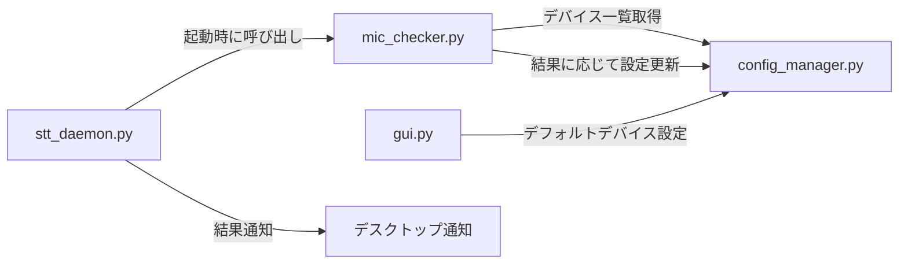

# マイクチェック機能の実装計画

## 概要

起動時にデフォルトマイクの生存確認を行い、無音なら他のデバイスに自動切り替え＋通知する機能を疎結合で実装。

## アーキテクチャ



`mic_checker.py` は独立モジュール。`stt_daemon.py` からワンコールで使い、GUIは設定を書くだけ。

## 修正内容

---

### 新規モジュール

#### [NEW] [mic_checker.py](file:///home/heppo/ai_tools/speech_to_text/mic_checker.py)

短時間（0.5秒）録音してRMS値を計算し、マイクの生存を判定する独立モジュール：

```python
def check_device(device_index, duration=0.5, threshold=0.0001) -> dict:
    """1デバイスをチェック → {"alive": bool, "rms": float, "error": str|None}"""

def find_working_device(preferred_index=None) -> dict:
    """優先デバイス→全デバイスの順でチェック
    → {"device_index": int|None, "fallback": bool, "message": str}"""
```

- `threshold`は非常に小さい値（ノイズフロアで十分検出可能）
- エラー（デバイスが存在しない等）はalive=Falseとして扱う

---

### 設定管理

#### [MODIFY] [config_manager.py](file:///home/heppo/ai_tools/speech_to_text/config_manager.py)

`DEFAULT_CONFIG` に `default_device_index` を追加：

```diff
 "device_index": None,
+"default_device_index": None,  # ユーザーが明示的に選んだデフォルト
```

`device_index` = 現在使用中のデバイス（自動切り替えで変わりうる）
`default_device_index` = ユーザーが「これを使いたい」と設定したデバイス

---

### GUI

#### [MODIFY] [gui.py](file:///home/heppo/ai_tools/speech_to_text/gui.py)

デバイスドロップダウンの横に **「デフォルトに設定」ボタン** を追加：

```python
btn_set_default = ft.IconButton(
    icon="star",
    tooltip=t("set_default_device"),
    on_click=on_set_default
)
# dd_device と横並び
ft.Row([dd_device, btn_set_default])
```

ボタン押下時、選択中のデバイスを `default_device_index` に保存し、視覚フィードバックを表示。

---

### デーモン

#### [MODIFY] [stt_daemon.py](file:///home/heppo/ai_tools/speech_to_text/stt_daemon.py)

`__init__()` の末尾（ワーカー起動後）にマイクチェックを呼び出し：

```python
# マイクチェック（バックグラウンド）
threading.Thread(target=self._startup_mic_check, daemon=True).start()
```

`_startup_mic_check()` メソッド内で：
1. `mic_checker.find_working_device(preferred)` を呼ぶ
2. フォールバックが発生した場合 → `notify-send` で通知
3. 全デバイス死亡 → 警告通知

---

### 多言語対応

#### [MODIFY] [i18n.py](file:///home/heppo/ai_tools/speech_to_text/i18n.py)

追加キー（ja/en/zh）：

| キー | 日本語 |
|---|---|
| `set_default_device` | デフォルトに設定 |
| `default_device_set` | デフォルトデバイスを設定しました |
| `mic_check_fallback` | デフォルトマイク ({name}) に不具合があるため、{new_name} に切り替えました |
| `mic_check_no_device` | 音声を検出できるマイクが見つかりません。マイクの接続を確認してください |

## 検証計画

### 手動検証
1. GUIでデフォルトデバイスを設定→config.jsonに保存されることを確認
2. 正常なマイクで起動→フォールバック発生しないことを確認
3. 存在しないデバイスIndexをdefaultに設定→フォールバック通知が出ることを確認
