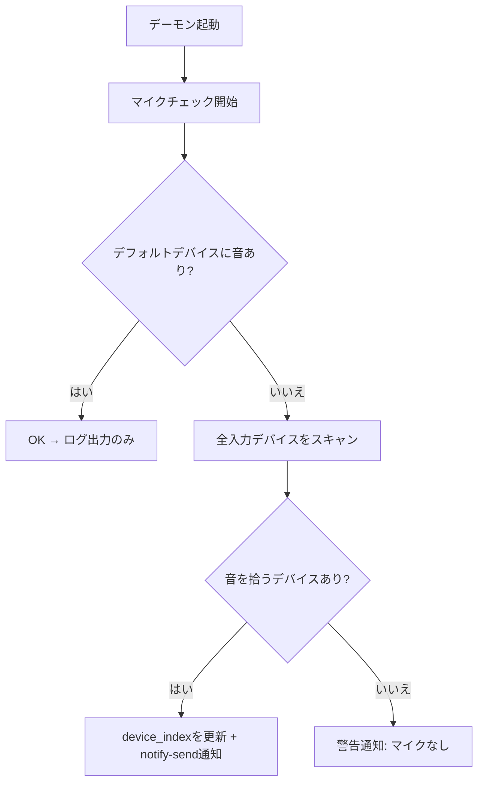

# マイクチェック機能 - ウォークスルー

## 変更内容

### 新規ファイル
- [mic_checker.py](file:///home/heppo/ai_tools/speech_to_text/mic_checker.py) — 疎結合なマイク生存確認モジュール

### 変更ファイル

| ファイル | 変更内容 |
|---|---|
| [config_manager.py](file:///home/heppo/ai_tools/speech_to_text/config_manager.py) | `default_device_index` 設定キー追加 |
| [gui.py](file:///home/heppo/ai_tools/speech_to_text/gui.py) | デバイスリスト横に ★「デフォルトに設定」ボタン追加 |
| [stt_daemon.py](file:///home/heppo/ai_tools/speech_to_text/stt_daemon.py) | 起動時マイクチェック + `notify-send` 通知 |
| [i18n.py](file:///home/heppo/ai_tools/speech_to_text/i18n.py) | 翻訳キー追加 (ja/en/zh) |

## 動作フロー

## 検証結果

- ✅ 全6ファイル構文チェック通過
- ⬜ 実機テストはユーザーによる手動確認待ち
