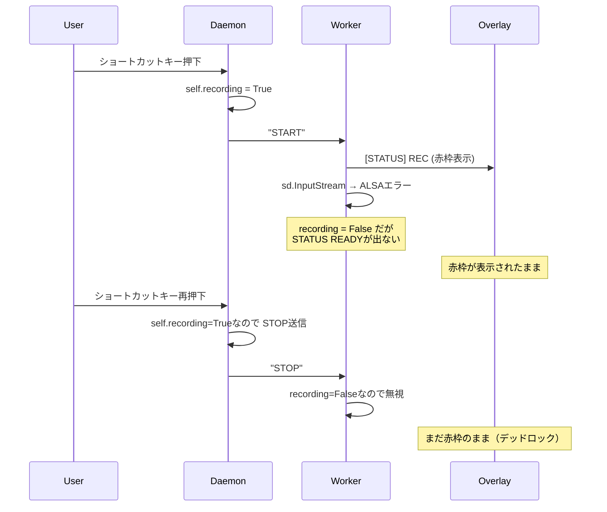

# 録音フリーズバグの修正計画

## 問題の概要

録音開始ショートカットを押すと赤枠が表示されたままフリーズし、再度ショートカットを押しても解除されない。ローカルモデル・オンラインAPI両方で発生。

## 原因分析

ログから **2つの根本原因** を特定：

### 原因1: サンプルレート不整合

`config.json` に `"sample_rate": 44100` があるが、ワーカー ([stt_worker_unified.py](file:///home/heppo/ai_tools/speech_to_text/stt_worker_unified.py)) が使用するのはハードコードされた定数 `SAMPLE_RATE = 16000`。デバイスが16000Hzに非対応でALSAエラーとなる：

```
Error opening InputStream: Invalid sample rate [PaErrorCode -9997]
```

### 原因2: エラー時のステータス未リカバリ（フリーズの直接原因）

[start_recording()](file:///home/heppo/ai_tools/speech_to_text/stt_worker_unified.py#L199-L239) の `_record_loop()` 内で録音エラーが発生すると：
1. `self.recording = False` は設定されるが、`[STATUS] READY` が出力されない
2. デーモンのオーバーレイに「READY」が通知されず、**赤枠が消えない**
3. デーモン側の `self.recording` フラグは `True` のまま → 次のトグルは `STOP` として処理される
4. ワーカーは録音していないので `STOP` は無視される → **完全にデッドロック状態**



## ログに関する回答

> 今後のメンテナンスのために、聞きたいのですが、これは適切にログが残りますか？

**現状のログ状況：**

| ログ | 場所 | 内容 |
|---|---|---|
| ワーカーログ | `nohup.out` / stdout | ✅ エラーは記録される |
| オーバーレイログ | `/tmp/overlay_debug.log` | ✅ コマンド受信は記録される |
| デーモンログ | `nohup.out` | ⚠️ 最低限のみ（ステータス変化の詳細なし） |

> [!WARNING]
> 問題は「ログが残らない」ことではなく、**エラーが発生してもステータスが正常系に復帰しない**ことです。今回の修正でエラーリカバリを追加すれば、ログにもエラー→リカバリの流れが明確に記録されるようになります。

## 修正内容

---

### ワーカー

#### [MODIFY] [stt_worker_unified.py](file:///home/heppo/ai_tools/speech_to_text/stt_worker_unified.py)

**修正1: config.json の `sample_rate` を使用する**

```diff
-SAMPLE_RATE = 16000
+DEFAULT_SAMPLE_RATE = 16000
```

`start_recording()` の `_record_loop()` 内で config の `sample_rate` を使用し、フォールバックとして `DEFAULT_SAMPLE_RATE` を使う：

```diff
 def _record_loop():
     device_idx = self.config.get("device_index")
     if device_idx == "default": device_idx = None
+    sample_rate = self.config.get("sample_rate", DEFAULT_SAMPLE_RATE)
     
     try:
-        with sd.InputStream(samplerate=SAMPLE_RATE, device=device_idx, channels=CHANNELS, callback=self._audio_callback):
+        with sd.InputStream(samplerate=sample_rate, device=device_idx, channels=CHANNELS, callback=self._audio_callback):
```

**修正2: エラー時にステータスをREADYに復帰**

```diff
     except Exception as e:
         logger.error(f"Recording error: {e}")
         self.recording = False
+        print("[STATUS] READY")
+        sys.stdout.flush()
```

**修正3: `stop_and_transcribe()` のオーディオリサンプリング対応**

config の sample_rate が 16000 以外の場合、推論前に 16000Hz にリサンプリングする処理を追加。

---

### デーモン

#### [MODIFY] [stt_daemon.py](file:///home/heppo/ai_tools/speech_to_text/stt_daemon.py)

**修正: READYステータス受信時にデーモンの recording フラグをリセット**

`on_worker_status()` を拡張し、READY受信時に `self.recording = False` を設定：

```diff
 def on_worker_status(self, status):
     self.overlay_mgr.send_command(status)
+    if status == "READY":
+        self.recording = False
```

## 検証計画

### 手動検証

1. デーモンを起動し、ショートカットキーで録音を開始
2. 正常に録音→停止→テキスト入力されることを確認
3. `nohup.out` と `/tmp/overlay_debug.log` にエラー→リカバリの流れが記録されていることを確認
